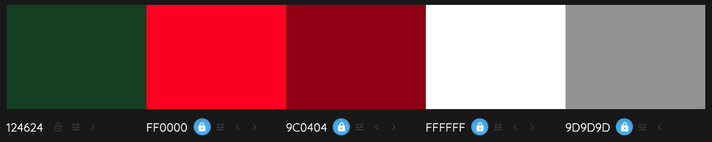
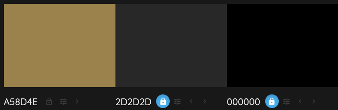

# Discover Ireland #

## Introduction ##

The Discover Ireland website was created and built by Stephen Mc Govern. The aim of the website is to provide people who are thinking of visiting Dublin, Cork or Galway with information on each city to help them choose which one they would prefer to visit.

> 
## **Table of contents** ## 

## **1. User Experience (UX)** ##
* 1.1 Target audience
* 1.2 Visitor goals
* 1.3 User stories
* 1.4 Design choices
* 1.5 Wire frames

## **2. Features** ##
* 2.1 The Navbar
* 2.2 JavaScript weather widget 
* 2.3 Photo Carousel 
* 2.4 SkyScanner JavaScript Widget 
* 2.5 YouTube API videos 
* 2.6 Google Maps API 
* 2.7 Contact Us Forum
* 2.3 The Footer

## **3. Technologies/Languages Used** ##
* 3.1 Gitpod
* 3.2 HTML5
* 3.3 CSS
* 3.4 JavaScript
* 3.5 Bootstrap
* 3.6 Google fonts
* 3.7 Font Awesome
* 3.8 W3schools
* 3.9 Balsamiq
* 3.10 Weather Widget API
* 3.11 Skyscanner JavaScript Widget
* 3.12 YouTube API
* 3.13 Google Maps API
* 3.14 Email JS 

## **4. Testing** ##
* 4.1 See testing.md document

## **5. Deployment** ##
* 5.1 Deployment
* 5.2 Cloning
* 5.3 Cloning Desktop

## **6. Credits** ##
* 6.1 Media
* 6.2 Code 
* 6.3 Acknowledgements

## **7. Contact Me** ##
* 7.1 LinkedIn
* 7.2 Email
* 7.3 Skype

## **8. Disclaimer** ##
* 8.1 Disclaimer on project
>

## **1. User Experience (UX)** ##

### **1.1 - Target Audience** ###

* This website is aimed at anyone who is thinking of, or who has already organized a trip to visit the Irish cities of Dublin, Cork or Galway. 

### **1.2 - Visitor goals** ###

* As a potential visitor to the city i want to be able to find out how can i get here from overseas? So flight information is one thing i need. I also want to be able to see options for hotels, restaurants,bars, cafe's and tourist attractions. As ive never been to the city before i would also like some recommendations from the people who run the website. Finally i want to be able to contact the people who run the website so i can ask them further questions if needed. 

### **1.3 - User Stories** ###

* 

### **1.4 - Design Choices** ###

* I wanted the website to be very visual and not just a lot of text. Therefore I have incorporated a lot of imagery on each page, inserted weather and flights widgets, YouTube videos and google maps with places/locations. 

**FONTS**

* For the website i decided to use the google font style of Forum. Forum has antique, classic "Roman" proportions. It can be used to set body texts and works well in titles and headlines too. It is truly multilingual, with glyphs for Central and Eastern Europe, Baltics, Cyrillic and Asian Cyrillic communities. The link to the Forum font on Google Font can be found by clicking: [Here](https://fonts.google.com/specimen/Forum?preview.text_type=custom#glyphs)

**ICONS**

* I also decided to incorporate some icons throughout the website. I did this because icons give a more visually pleasing experience for the user and also relate to the type of information that they are looking at. I also incorporated social media icons (Facebook, Twitter, Instagram, YouTube) that are located in the footer of the page.

* All of the icons on the site were taken from the Font Awesome website. The link to the Font Awesome website can be found by clicking: [Here](https://fontawesome.com/)

**COLOURS**

* I used the website colour mind when deciding on which colours to use. The website uses a generator to help you select the best matching colour palettes for your project. The website can be found by clicking this link: [Here](http://colormind.io/)

* For the base colours i decided to go with the following colour palette 

* The reason for this particular pallet is because these are the county colours for each city. 

FF0000 & FFFFFF are the colours of Cork  
9C0404 & FFFFFF are the colours od Galway

* Dublin's official colour is #040484 which is a navy blue, however the initial feedback i got from people who viewed the early site was that as the site is a guide to Irish cities they would have liked, and expected to see a lot more green. Therefore i decided to make the Dublin page a mix of 

124624 (Green) & FFFFFF (White)  
9D9D9D is used as the border on several items on the page. 

* I also went for a secondary colour palette for more minor touches on the site. These colours can be seen below:

### **1.5 - Wire Frames** ###

[Homepage Desktop](https://ibb.co/0J7YYNN) 
[Homepage iPad Horizontal](https://ibb.co/74tx7yr) 
[Homepage iPad Vertical](https://ibb.co/9Y8jjMr) 
[Homepage mobile phone](https://ibb.co/pdVcJKW) 

[City page Desktop](https://ibb.co/C7J1ydC) 
[City page iPad Horizontal](https://ibb.co/g6zg3RG) 
[City page iPad Vertical](https://ibb.co/vDkK11v) 
[City page mobile phone](https://ibb.co/0ZqnqSf)
>

### **3. Technologies/Languages Used** ###

3.1 - [Gitpod](https://www.gitpod.io/) - Is the IDE recommended for Code Institute students and the one i chose to develop this project in. 
3.2 - [HTML5](https://html.com/html5/#What_is_HTML) - This is the markup language i used for this project. 
3.3 - [CSS](https://en.wikipedia.org/wiki/CSS) - I used CSS to help alter and adjust the presentation of the website to create a pleasant user experience. 
3.4 - [JavaScript](https://en.wikipedia.org/wiki/JavaScript) - JavaScript often abbreviated as JS, is a programming language that conforms to the ECMAScript specification. Alongside HTML and CSS, JavaScript is one of the core technologies of the World Wide Web. 
3.5 - [Bootstrap](https://getbootstrap.com/) - Bootstrap is the most popular CSS Framework for developing responsive and mobile-first websites. Bootstrap 4 is the version i used for the development of this project. 
3.6 - [Google fonts](https://fonts.google.com/) - Launched in 2010 Google Fonts is a library of 1,023 free licensed font families. 
3.7 - [Font Awesome](https://fontawesome.com/) - Font Awesome is a font and icon toolkit based on CSS and Less. It was made by Dave Gandy for use with Bootstrap, and later was incorporated into the BootstrapCDN. Font Awesome has a 38% market share among those websites that use third-party font scripts on their platform. 
3.8 [W3schools](https://www.w3schools.com/) - W3Schools is a training website for learning web technologies online.  
3.9 - [Balsamiq](https://balsamiq.com/) - Balsamiq Wireframes is a rapid low-fidelity UI wireframing tool that reproduces the experience of sketching on a notepad or whiteboard. 
3.10 - [Weather Widget](https://weatherwidget.io/) - Is a free customizable weather widget that you incorporate into your website using JavaScript and HTML. 
3.11 - [Skyscanner JavaScript Widget](https://www.partners.skyscanner.net/affiliates/widgets-documentation/simple-flight-search-widget) Skyscanner is a travel fare aggregator website and travel metasearch engine. Site visitors can use Skyscanner to plan and book their travels, including flights, hotels, and car hire, at the best prices. 
3.12 - [YouTube](https://www.youtube.com/) - YouTube is an American online video-sharing platform and the second largest search engine in the world. Created in February 2005 by three former PayPal employees YouTube was bought by Google 2006 
3.13 Google Maps API 
3.14 - [Email JS](https://www.emailjs.com/) - EmailJS helps to send emails using client-side technologies only. No server is required, just connect EmailJS to one of the supported email services, create an email template, and use our Javascript library to trigger an email.
>
### **5. Deployment** ###

5.1 Deployment

To deploy the site on Github i undertook the following steps:

1. Navigated to my profile page on Github
2. Selected this project from the repositories
3. Clicked on settings
4. Scroll down to the Github pages section
5. Click where is says source and in the dropdown menu select master
6. Click on the next dropdown menu to the right select /(root)
7. Click save

You will then receive a confirmation saying the page has been published and also be provided with the link where people can view your site.

>
### **6. Credits** ###
6.1 Media

dublin flag By Setanta Saki - Own work, CC BY-SA 3.0, https://commons.wikimedia.org/w/index.php?curid=1171868

guinness store house By Steven Lek - Own work, CC BY-SA 4.0, https://commons.wikimedia.org/w/index.php?curid=51039263 

6.2 Code

6.3 Acknowledgements

* A huge thank you to all of the tutor team at Code Institute who were always on hand whenever i needed their support.
* A big thank you to my mentor Dick Vlaanderen who gave me great feedback on my initial ideas for the project.
* A final big thank you to all of the other students, CI alumni and CI staff who were always willing to help out and advise on the official CI Slack channels.

>
### **7. Contact Me** ###

If you need to reach me i can be contacted via the three methods below:

7.1 - [LinkedIn](https://www.linkedin.com/in/stephenmcgovern01/) 
7.2 - [Email](mailto:stephen_xyz1@hotmail.com) 
7.3 - [Skype](https://join.skype.com/invite/ndruMu7qVuKZ)
>
### **8. Disclaimer** ###
* 8.1 - This website and all of its content was completed for my personal assessment
and is strictly for educational purposes only.