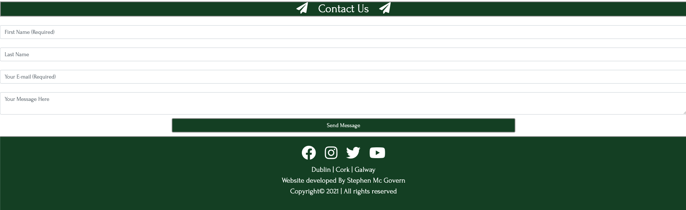

# Discover Ireland #

## Introduction ##

The Discover Ireland website was created and built by Stephen Mc Govern. The aim of the website is to provide people who are thinking of visiting Dublin, Cork or Galway with information on each city to help them choose which one they would prefer to visit.

> 
## **Table of contents** ## 

## **1. User Experience (UX)** ##
* 1.1 Target audience
* 1.2 Visitor goals
* 1.3 User stories
* 1.4 Design choices
* 1.5 Wire frames

## **2. Features** ##
* 2.1 The Navbar
* 2.2 JavaScript weather widget 
* 2.3 Photo Carousel 
* 2.4 SkyScanner JavaScript Widget 
* 2.5 YouTube API videos 
* 2.6 Google Maps API 
* 2.7 Contact Us Forum
* 2.3 The Footer

## **3. Technologies/Languages Used** ##
* 3.1 Gitpod
* 3.2 HTML5
* 3.3 CSS
* 3.4 JavaScript
* 3.5 Bootstrap
* 3.6 Google fonts
* 3.7 Font Awesome
* 3.8 W3schools
* 3.9 Balsamiq
* 3.10 Weather Widget API
* 3.11 Skyscanner JavaScript Widget
* 3.12 YouTube API
* 3.13 Google Maps API
* 3.14 Email JS 

## **4. Testing** ##
* 4.1 See testing.md document

## **5. Deployment** ##
* 5.1 Deployment
* 5.2 Cloning
* 5.3 Cloning Desktop

## **6. Credits** ##
* 6.1 Media
* 6.2 Code 
* 6.3 Acknowledgements

## **7. Contact Me** ##
* 7.1 LinkedIn
* 7.2 Email
* 7.3 Skype

## **8. Disclaimer** ##
* 8.1 Disclaimer on project
>

## **1. User Experience (UX)** ##

### **1.1 - Target Audience** ###

* This website is aimed at anyone who is thinking of, or who has already organized a trip to visit the Irish cities of Dublin, Cork or Galway. 

### **1.2 - Visitor goals** ###

* As a potential visitor to the city i want to be able to find out how can i get here from overseas? So flight information is one thing i need. I also want to be able to see options for hotels, restaurants,bars, cafe's and tourist attractions. As ive never been to the city before i would also like some recommendations from the people who run the website. Finally i want to be able to contact the people who run the website so i can ask them further questions if needed. 

### **1.3 - User Stories** ###

* 

### **1.4 - Design Choices** ###

* I wanted the website to be very visual and not just a lot of text. Therefore I have incorporated a lot of imagery on each page, inserted weather and flights widgets, YouTube videos and google maps with places/locations. 

**FONTS**

* For the website i decided to use the google font style of Forum. Forum has antique, classic "Roman" proportions. It can be used to set body texts and works well in titles and headlines too. It is truly multilingual, with glyphs for Central and Eastern Europe, Baltics, Cyrillic and Asian Cyrillic communities. The link to the Forum font on Google Font can be found by clicking: [Here](https://fonts.google.com/specimen/Forum?preview.text_type=custom#glyphs)

**ICONS**

* I also decided to incorporate some icons throughout the website. I did this because icons give a more visually pleasing experience for the user and also relate to the type of information that they are looking at. I also incorporated social media icons (Facebook, Twitter, Instagram, YouTube) that are located in the footer of the page.

* All of the icons on the site were taken from the Font Awesome website. The link to the Font Awesome website can be found by clicking: [Here](https://fontawesome.com/)

**COLOURS**

* I used the website colour mind when deciding on which colours to use. The website uses a generator to help you select the best matching colour palettes for your project. The website can be found by clicking this link: [Here](http://colormind.io/)

* For the base colours i decided to go with the following colour palette 

* The reason for this particular pallet is because these are the county colours for each city. 

FF0000 & FFFFFF are the colours of Cork  
9C0404 & FFFFFF are the colours od Galway

* Dublin's official colour is #040484 which is a navy blue, however the initial feedback i got from people who viewed the early site was that as the site is a guide to Irish cities they would have liked, and expected to see a lot more green. Therefore i decided to make the Dublin page a mix of 

124624 (Green) & FFFFFF (White)  
9D9D9D is used as the border on several items on the page. 

* I also went for a secondary colour palette for more minor touches on the site. These colours can be seen below:

### **1.5 - Wire Frames** ###

[Homepage Desktop](https://ibb.co/0J7YYNN) 
[Homepage iPad Horizontal](https://ibb.co/74tx7yr) 
[Homepage iPad Vertical](https://ibb.co/9Y8jjMr) 
[Homepage mobile phone](https://ibb.co/pdVcJKW) 

[City page Desktop](https://ibb.co/C7J1ydC) 
[City page iPad Horizontal](https://ibb.co/g6zg3RG) 
[City page iPad Vertical](https://ibb.co/vDkK11v) 
[City page mobile phone](https://ibb.co/0ZqnqSf)
>
## **2. Features** ##

I have created the website so all of the city pages have the exact same features. I did this because i wanted the users to have the same features on every page so no matter what city they were thinking of visiting, the layout and features will be the same to help with user experience. The breakdown of the features on each page are listed below: 

### **2.1 - The Navbar** ###

For the Navbar i decided to use a standard Bootstrap 4.4 Navbar. I chose this option because i wanted the Navbar to be responsive on all screen sizes and bootstrap offers this easily. 

The Navbar on each page is standardized, the link to the homepage is located on the top left hand side, on the right hand side we have 

1. About City
2. Getting Here 
3. Things To Do
4. Contact Us

On smaller screen sizes the navbar will collapse into a hamburger menu that when clicked will expand and reveal the nav bar items.

### **2.2 - JavaScript weather widget** ###

Below the Navbar i have installed a weather widget that will display an animated 7 day forecast. This will display the weather for each city when the user is on the page. I have also set this so the background will reflect the current weather conditions and whether it is night or day. The widget is also responsive and will adjust depending on screen size.

### **2.3 - Photo Carousel** ###

I wanted to use some great images on the website. To achieve this i have used a bootstrap carousel to show several different images of each city to users. The photos are also set to auto scroll and at the footer of the images there is some text that describes what each image is. 

### **2.4 - SkyScanner JavaScript Widget** ###

I have also installed a Skyscanner widget on the website. This will allow users of the site to enter the city they are flying from, the dates they are looking to fly, and when the click on search flights Skyscanner will give them flight availability and prices. As the site isnt an integrated partner booking a flight on the site isnt possible, instead the user is diverted to the Skyscanner page.

### **2.5 - YouTube API videos** ###

I wanted to use as wide a range of options as possible to display information to users. On every city page i have created a YouTube video that gives a very short introduction about each city. This was done using the YouTube API. 

### **2.6 - Google Maps API** ###

### **2.7 - Contact Us Forum** ###

At the bottom of every page i have placed a contact us form where users can send emails direct to us. The contact us form has Email JS operating on the backend. Once a user clicks ont he send message button an alert will populate to show the user the message was sent. Email JS will also send an auto reply to the user to let them know their message was successfully received and that we will be back in contact with them.

### **2.8 - The Footer** ###

In the footer i have listed all of the companies social media links. As with the navbar, the footer is identical on each page to maintain consistency no matter what page the user finds themselves on.

>
### **3. Technologies/Languages Used** ###

3.1 - [Gitpod](https://www.gitpod.io/) - Is the IDE recommended for Code Institute students and the one i chose to develop this project in. 
3.2 - [HTML5](https://html.com/html5/#What_is_HTML) - This is the markup language i used for this project. 
3.3 - [CSS](https://en.wikipedia.org/wiki/CSS) - I used CSS to help alter and adjust the presentation of the website to create a pleasant user experience. 
3.4 - [JavaScript](https://en.wikipedia.org/wiki/JavaScript) - JavaScript often abbreviated as JS, is a programming language that conforms to the ECMAScript specification. Alongside HTML and CSS, JavaScript is one of the core technologies of the World Wide Web. 
3.5 - [Bootstrap](https://getbootstrap.com/) - Bootstrap is the most popular CSS Framework for developing responsive and mobile-first websites. Bootstrap 4 is the version i used for the development of this project. 
3.6 - [Google fonts](https://fonts.google.com/) - Launched in 2010 Google Fonts is a library of 1,023 free licensed font families. 
3.7 - [Font Awesome](https://fontawesome.com/) - Font Awesome is a font and icon toolkit based on CSS and Less. It was made by Dave Gandy for use with Bootstrap, and later was incorporated into the BootstrapCDN. Font Awesome has a 38% market share among those websites that use third-party font scripts on their platform. 
3.8 [W3schools](https://www.w3schools.com/) - W3Schools is a training website for learning web technologies online.  
3.9 - [Balsamiq](https://balsamiq.com/) - Balsamiq Wireframes is a rapid low-fidelity UI wireframing tool that reproduces the experience of sketching on a notepad or whiteboard. 
3.10 - [Weather Widget](https://weatherwidget.io/) - Is a free customizable weather widget that you incorporate into your website using JavaScript and HTML. 
3.11 - [Skyscanner JavaScript Widget](https://www.partners.skyscanner.net/affiliates/widgets-documentation/simple-flight-search-widget) Skyscanner is a travel fare aggregator website and travel metasearch engine. Site visitors can use Skyscanner to plan and book their travels, including flights, hotels, and car hire, at the best prices. 
3.12 - [YouTube](https://www.youtube.com/) - YouTube is an American online video-sharing platform and the second largest search engine in the world. Created in February 2005 by three former PayPal employees YouTube was bought by Google 2006 

3.13 Google Maps API 

3.14 - [Email JS](https://www.emailjs.com/) - EmailJS helps to send emails using client-side technologies only. No server is required, just connect EmailJS to one of the supported email services, create an email template, and use our Javascript library to trigger an email.
>
## **5. Deployment** ##

### **5.1 Deployment** ###

To deploy the site on Github i undertook the following steps:

1. Navigated to my profile page on Github
2. Selected this project from the repositories
3. Clicked on settings
4. Scroll down to the Github pages section
5. Click where is says source and in the dropdown menu select master
6. Click on the next dropdown menu to the right select /(root)
7. Click save

You will then receive a confirmation saying the page has been published and also be provided with the link where people can view your site.

>
## **6. Credits** ##

### **6.1 Media** ###

GLOBAL 

Airport Arrivals Picture purchased from iStock Photo
 
[Image here](https://www.istockphoto.com/photo/airport-arrivals-sign-in-dublin-ireland-gm181077388-25334697) 

DUBLIN PAGE 

CAROUSEL IMAGES 

Dublin city at night carousel image 
Photo by <a href="https://unsplash.com/@andrei_carina?utm_source=unsplash&utm_medium=referral&utm_content=creditCopyText">Andrei Carina</a> on Unsplash
 
[Image Here](https://unsplash.com/photos/jLi7xbYnYro)
  
Howth cliffs carousel image 
Photo by <a href="https://unsplash.com/@aem?utm_source=unsplash&utm_medium=referral&utm_content=creditCopyText">Adam Markon</a> on  Unsplash.
 
[Image Here](https://unsplash.com/photos/Q-9FsufnVEA)

Trinity college carousel image 
Photo by <a href="https://unsplash.com/@alexblock?utm_source=unsplash&utm_medium=referral&utm_content=creditCopyText">Alex Block</a> on Unsplash
 
[Image Here](https://unsplash.com/photos/PdDBTrkGYLo)

THINGS TO DO DUBLIN VIDEO

Dublin: Take A Deep Breath Youtube Video 
All rights belong to Visit Dublin

OUR RECOMMENDATIONS DUBLIN

Whelan's Music Venue 
Photo by <a href="https://unsplash.com/@themephotos?utm_source=unsplash&utm_medium=referral&utm_content=creditCopyText">Theme Photos</a> on Unsplash
 
[Image Here](https://unsplash.com/photos/kPHYuzqoaz0)

Network Coffee Image 
Image supplied by Network Coffee  
All rights to Network Coffee 

EatTokyo Sushi Image 
Photo by <a href="https://unsplash.com/@viniciusbenedit?utm_source=unsplash&utm_medium=referral&utm_content=creditCopyText">Vinicius Benedit</a> on Unsplash
 
[Image Here](https://unsplash.com/photos/-1GEAA8q3wk)

Guinness Storehouse Image 
Photo by <a href="https://unsplash.com/@erikjakeix?utm_source=unsplash&utm_medium=referral&utm_content=creditCopyText">Erik Jacobson</a> on Unsplash
 
[Image Here](https://unsplash.com/photos/w578cN0JxIw)
  
>
CORK PAGE 

CAROUSEL IMAGES 

Cork at night carousel image
 
Photo by <a href="https://unsplash.com/@2sometravel?utm_source=unsplash&utm_medium=referral&utm_content=creditCopyText">2sometravel</a> on Unsplash.
 
[Image Here](https://unsplash.com/photos/jiXbDuh8YIo)

Gougane barra church carousel image 
 
Photo by <a href="https://unsplash.com/@mrmarkdejong?utm_source=unsplash&utm_medium=referral&utm_content=creditCopyText">Mark de Jong</a> on Unsplash
 
[Image Here](https://unsplash.com/photos/P8TK5WPyFQY)  

Cork river at sunset carousel image
 
Photo by <a href="https://unsplash.com/@imjamie?utm_source=unsplash&utm_medium=referral&utm_content=creditCopyText">Jamie O’Sullivan</a> on Unsplash
 
[Image Here](https://unsplash.com/photos/WAh9lIRcVaU)
  
THINGS TO DO CORK VIDEO

PureCork: Cork Awaits Youtube Video 
All rights belong to Pure Cork Visit

OUR RECOMMENDATIONS CORK

Costigan's Pub (Our top recommendations) image
 
Photo by <a href="https://unsplash.com/@mehrad_vosoughi?utm_source=unsplash&utm_medium=referral&utm_content=creditCopyText">Mehrad Vosoughi</a> on Unsplash
 
[Image Here](https://unsplash.com/photos/HpN5rf4QVuU)
  
The English Market (Our top recommendations) image
 
Photo by <a href="https://unsplash.com/@nickkarvounis?utm_source=unsplash&utm_medium=referral&utm_content=creditCopyText">Nick Karvounis</a> on Unsplash
 
[Image Here](https://unsplash.com/photos/xrDL8xOgeJQ)

The Blarney Stone (Our top recommendations) image
 
Photo by <a href="https://unsplash.com/@connormisset?utm_source=unsplash&utm_medium=referral&utm_content=creditCopyText">Connor Misset</a> on Unsplash
 
[Image Here](https://unsplash.com/photos/Sn-5Wcg4P9o)
  
Cycle Tour Cork (Our top recommendations) image
 
Photo by <a href="https://unsplash.com/@maxberger?utm_source=unsplash&utm_medium=referral&utm_content=creditCopyText">Max Berger</a> on Unsplash
 
[Image Here](https://unsplash.com/photos/GXvrq21TmAs)

>
GALWAY PAGE 

CAROUSEL IMAGES 

Galway harbour night image
 
Photo by <a href="https://unsplash.com/@markusvoetter?utm_source=unsplash&utm_medium=referral&utm_content=creditCopyText">Markus Voetter</a> on Unsplash
 
[Image Here](https://unsplash.com/photos/s12s4dZSwLk)

Galway harbour houses carousel image 
 
Photo by <a href="https://unsplash.com/@roryhennessey?utm_source=unsplash&utm_medium=referral&utm_content=creditCopyText">Rory Hennessey</a> on Unsplash
 
[Image Here](https://unsplash.com/photos/UR-9hOEW-Ww)

Killary Harbour carousel image
 
Photo by <a href="https://unsplash.com/@olivier_twwli?utm_source=unsplash&utm_medium=referral&utm_content=creditCopyText">Olivier Guillard</a> on Unsplash
 
[Image Here](https://unsplash.com/photos/T5DAAfCGGQg)
  
THINGS TO DO GALWAY VIDEO

Discover Ireland: Top Things To Do In Cork Youtube Video 
All rights belong to Discover Ireland

OUR RECOMMENDATIONS GALWAY 

The Quays Bar (Our top recommendations) image
 
Photo by <a href="https://unsplash.com/@themorganlane?utm_source=unsplash&utm_medium=referral&utm_content=creditCopyText">Morgan Lane</a> on Unsplash
 
[Image Here](https://unsplash.com/photos/wlY66otjq28)
  
BoTown Burger (Our top recommendations) image
 
Photo by <a href="https://unsplash.com/@leecampbell?utm_source=unsplash&utm_medium=referral&utm_content=creditCopyText">Lee  Campbell</a> on Unsplash.
 
[Image Here](https://unsplash.com/photos/ZP1dfOoSEi8)

Cliffs of Moher (Our top recommendations) image
 
Photo by <a href="https://unsplash.com/@federize?utm_source=unsplash&utm_medium=referral&utm_content=creditCopyText">Federico Beccari</a> on Unsplash.
 
[Image Here](https://unsplash.com/photos/AEallbg9q_A)
   
Esquires Coffee (Our top recommendations) image
 
Photo by <a href="https://unsplash.com/@nate_dumlao?utm_source=unsplash&utm_medium=referral&utm_content=creditCopyText">Nathan Dumlao</a> on Unsplash
[Image Here](https://unsplash.com/photos/6VhPY27jdps)
  
### **6.2 Code** ###

### **6.3 Acknowledgements** ###

* A huge thank you to all of the tutor team at Code Institute who were always on hand whenever i needed their support.
* A big thank you to my mentor Dick Vlaanderen who gave me great feedback on my initial ideas for the project.
* A final big thank you to all of the other students, CI alumni and CI staff who were always willing to help out and advise on the official CI Slack channels.

>
### **7. Contact Me** ###

If you need to reach me i can be contacted via the three methods below:

7.1 - [LinkedIn](https://www.linkedin.com/in/stephenmcgovern01/) 
7.2 - [Email](mailto:stephen_xyz1@hotmail.com) 
7.3 - [Skype](https://join.skype.com/invite/ndruMu7qVuKZ)
>
### **8. Disclaimer** ###
* 8.1 - This website and all of its content was completed for my personal assessment
and is strictly for educational purposes only.