# **Discover Ireland** #
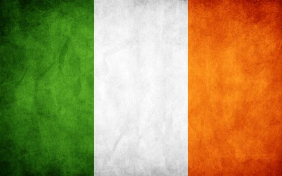

## **Introduction** ##

The Discover Ireland website was created and built by Stephen Mc Govern. The aim of the website is to provide people who are thinking of visiting Dublin, Cork or Galway with some information on each city and to help them decide which city they may prefer to visit.

Each city page has the same structure so users will be familiar with the layout if they are browsing all 3 cities. Each page gives a brief overview of the cities history, a short video from the tourist board of each city, a google map with a drop down menu providing some recommendations for categories of Hotels, Bars, Restaurants and Tourist Attractions. I also added an "Our top recommendations" section for places i think a tourist would definitely want to visit while in each city.

**ADDITIONAL FEATURES**

I also wanted users to the site to be able to price and book flights. View and book accommodation, restaurants, and tourist attractions. Some additional features i also added were:

1. A weather widget at the top of each page that gives an animated live 7 day forecast of the weather in each city. The weather in Ireland changes regularly and we often have 4 season in one day. This little feature will allow any user to check the next 7 days weather at a glance. 
2. A Skyscanner widget that is already preset to the nearest airport of each city. Users only need to enter their airport of origin and the dates they wish to travel and Skyscanner will provide them with a list of available flights. At the time of completing this project (April 2021)the Skyscanner widget is also incorporating a Covid-19 travel advice link as this information is also very important to any traveller wishing to book a flight on an airplane. 
3. Finally at the bottom of each page i have added a contact form that is powered by Email JS. When a user submits a message to the site i as the site owner will receive an email notification. The user will also receive an automated email reply confirming there message has been received and that we will be contacting them shortly to answer their enquiry. 

> 
## **Table of contents** ## 

## **1. User Experience (UX)** ##
* 1.1 Target audience
* 1.2 Visitor goals
* 1.3 User stories
* 1.4 Design choices
* 1.5 Wire frames

## **2. Features** ##
* 2.1 The Navbar
* 2.2 JavaScript weather widget 
* 2.3 Photo Carousel 
* 2.4 SkyScanner JavaScript Widget 
* 2.5 Video JS Player 
* 2.6 Google Maps API 
* 2.7 Contact Us Forum
* 2.3 The Footer

## **3. Technologies/Languages Used** ##
* 3.1 Gitpod
* 3.2 HTML5
* 3.3 CSS
* 3.4 JavaScript
* 3.5 Bootstrap
* 3.6 Google fonts
* 3.7 Font Awesome
* 3.8 W3schools
* 3.9 Balsamiq
* 3.10 Weather Widget API
* 3.11 Skyscanner JavaScript Widget
* 3.12 Video JS
* 3.13 Google Maps API
* 3.14 Email JS 
* 3.15 Favicon Generator 

## **4. Testing** ##
* 4.1 See [testing.md](testing.md) document 

## **5. Deployment** ##
* 5.1 Deployment
* 5.2 Cloning
* 5.3 Cloning Desktop

## **6. Credits** ##
* 6.1 Media
* 6.2 Code 
* 6.3 Acknowledgements

## **7. Contact Me** ##
* 7.1 LinkedIn
* 7.2 Email
* 7.3 Skype

## **8. Disclaimer** ##
* 8.1 Disclaimer on project
>

## **1. User Experience (UX)** ##

### **1.1 - Target Audience** ###

* This website is aimed at anyone who is thinking of, or who has already organized a trip to visit the Irish cities of Dublin, Cork or Galway. 

### **1.2 - Visitor goals** ###

As a potential visitor to the city i want to be able to find out a few different things. 

1. How can i get to the cities from overseas? So flight information is one thing i need. 
2. I want to be able to see options for hotels, restaurants, bars, and tourist attractions. 
3. As ive never been to the city before I would also like some recommendations from the people who run the website as they would have an idea of the things a visitor should see. 
4. Finally i want to be able to contact the people who run the website just incase i have any questions if needed. 

### **1.3 - User Stories** ###

**As a visitor to Discover Ireland i want/expect/need:**

* A simple user friendly site where i can get a brief overview of the city i am thinking of visiting. I want the layout of the site to be simple and to make sense so I am not confused or put off using it.
* I want the information I am presented with to be laid out in a way that is easy for me to navigate.
* I want the site to provide me with the contact details such as: phone number, address, email, website, and a google map location for things that they are recommending that i should see/do when im in the city.
* I hear the weather in Ireland is something that can change from day to day, i would also like to know a bit more about the weather conditions of each city before i visit so i can plan accordingly.
* I may be viewing the site several time for information, i will more than likely be viewing the site from a mobile phone or tablet. I want the site to have been designed responsively so that it is still easy to navigate and use on my mobile devices.
* I also expect to be able to connect to the sites social media channels with a simple click so i can keep up to date with anything that the site admins may post there. 
* Finally as a user I expect feedback from the website I am using when I interact with it. If i send a message to the website i would like a confirmation that my message has been sent successfully. 

### **User Experience Walk through** ### 

This user lands on the Discover Ireland homepage. They are thinking of doing a short weekend city break to Dublin next weekend with a group of their friends. On the landing page they see they have 3 options ot choose from. As the user is thinking of visiting Dublin they click on the Dublin option as this is the visit they want to find out more information about. 

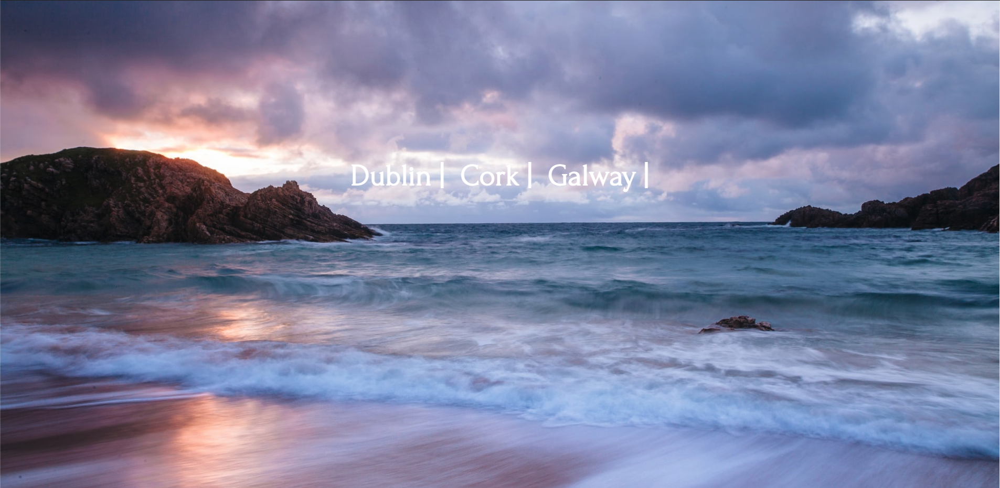

When the page opens the user can clearly see the Navbar at the top of the page that immediately tells them the sections they can expect to find on this page. They can also see a weather widget with a live 7 day animated forecast at the top of the page. This is very handy as the user is thinking of visiting next weekend so at a glance they can see the weather next weekend. They can also look through the images of Dublin on the Photo carousel. The use of great imagery produces a positive user response on any website. 

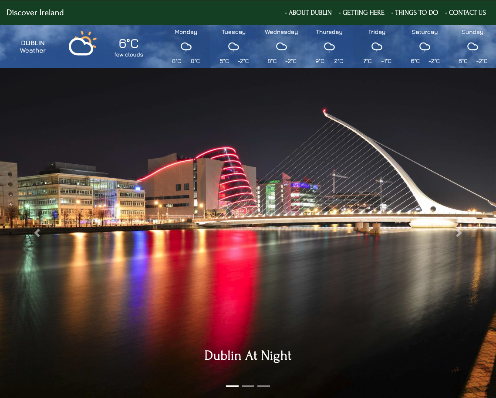

The user has never been to Dublin before so they scroll to the about Dublin page. Here they can read a small overview of the city.

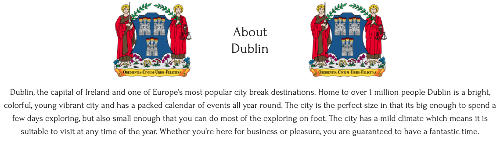

As the user will be flying into Dublin from the UK they want to know a bit more about the airport. They can see from the information provide that Dublin Airport is located 20/30 minutes from the city centre. The user can also see that the site has incorporated a Skyscanner widget into it. 

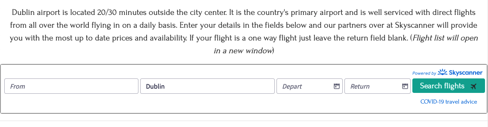

The user can also see that the closest airport to the city has already been pre-populated for them, so they only need to enter their airport of origin and the dates they are looking to travel. The user can also see that the skyscanner widget predictively lists all of the airports as they begin to type London, a nice addition that will save them some extra clicks. 

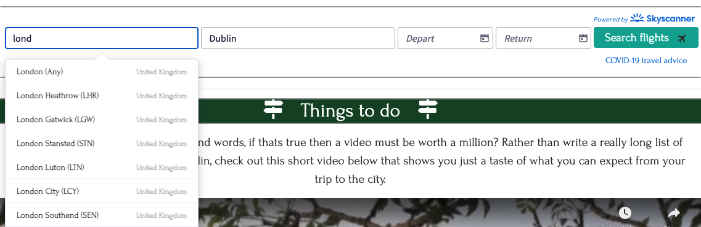

Now the user has entered their flight information into the widget they can press "Search Flights". Dublin was already pre-populated as the arrival airport so great that i didn't have to input that myself. 

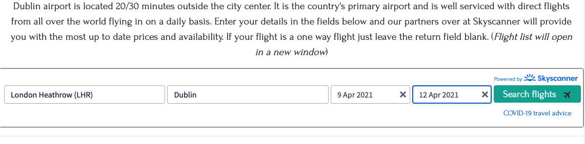

After the user presses search flights, as expected they can see they are brought to the skyscanner page where they can adjust the filter's they i need to price and book flights. But the user will come back to that later.

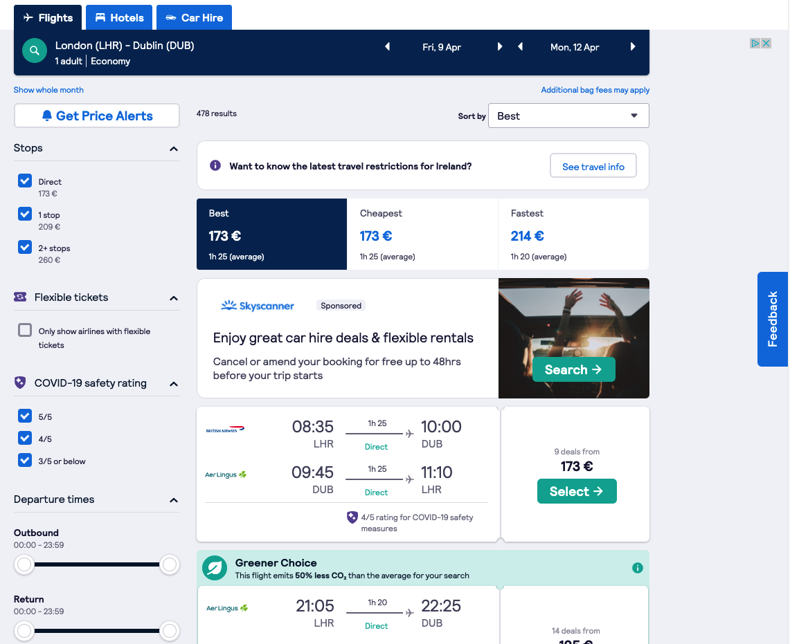

The user is wondering what can they and their friends do in Dublin. They can see that rather than have to read through endless lines of text there is a short video on the city that they can watch. The video is hosted on a simple Video JS player with basic controls which the majority of users will be very familiar with (No need to over complicate things with lots of controls). The videos are all around 1 and a half minutes long, great, its nice and short so the user can watch all of it without getting board or distracted. 

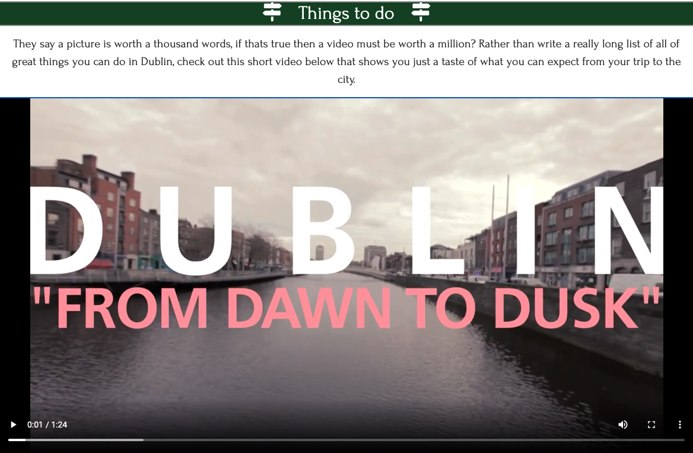

After watching the video the user is impressed with what looks to be a wide range of activities to do in the city. They can also see that Dublin seems to have a lot going on and it is not just a city for visitors who wish to come and drink in a pub. 

The user can see below the video there is a Google Map of Dublin being displayed. This again is something the user is very familiar with as Google maps are pretty much the standard on most websites. The user clicks on the local recommendations button.

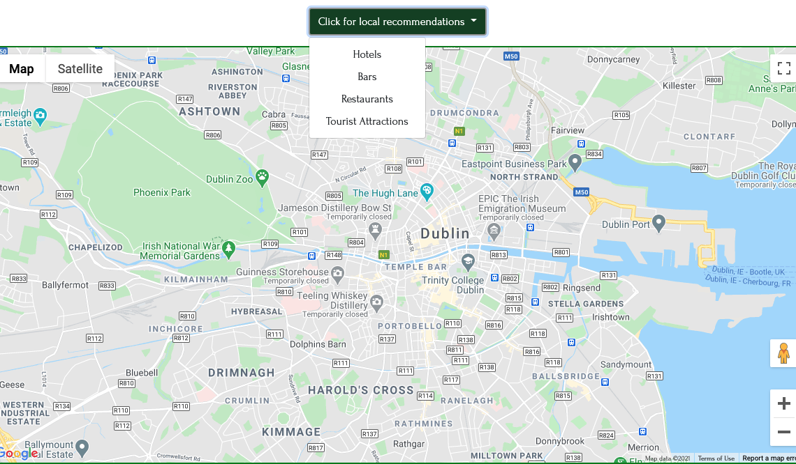

The user sees that they can select a number of categories. Lets start with finding a place to stay. The user clicks on Hotels and the map has generated a range of hotels that go from 5 star to hostel, a nice feature that will show the user a range of hotels for each price point. 

After clicking on all the accommodation choices listed the user sees that there is an award winning hostel listed thats right in the heart of the city. The user can see the hostels phone number, its address, phone number, and also read that its an award winning hostel, this looks like the one the user will go for.  

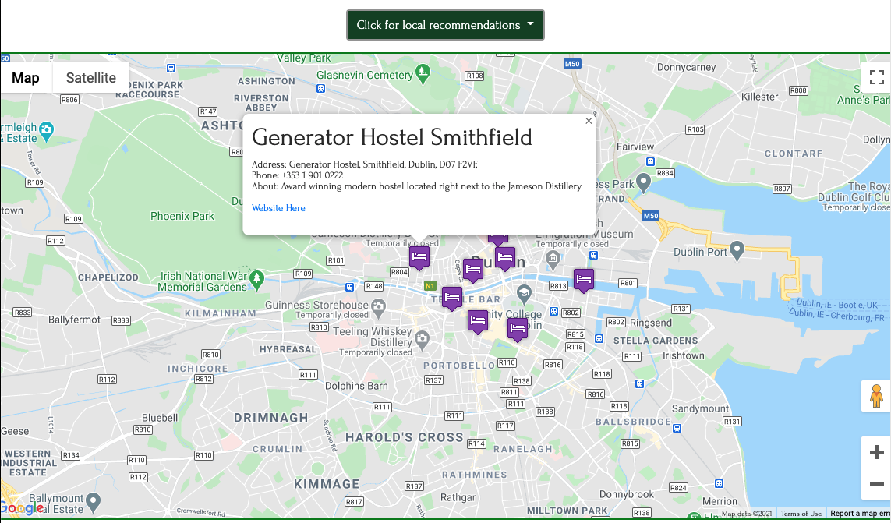

After clicking the "Website here" link in the information box the user is brought to the homepage of the Generator Hostel in a new tab that has opened. Great, now the user can enter the dates they are looking to stay and also enter the number of people traveling so they can get a quote for the accommodation. 

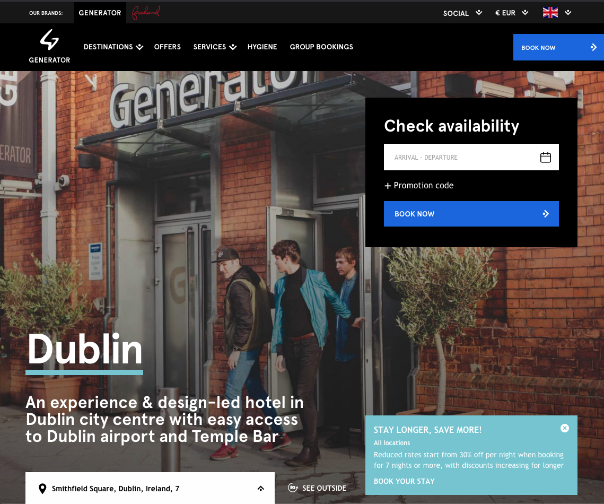

Couple this with the skyscanner widget the user can now start to put costings in place as they know what flights and accommodation will cost.

Upon scrolling a bit further down the page the user sees that the site operator has listed some of their own top recommendations. This always creates a positive user experience as when visiting a new city you are always on the look out for the best hidden spots. The user can see there is a pub listed, a coffee shop, a sushi restaurant and also a recommendation for the guinness storehouse. 

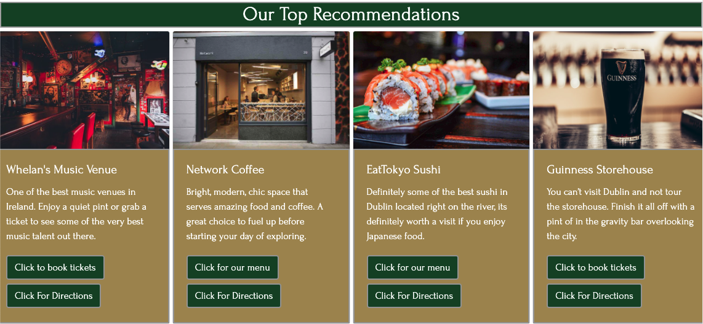

At the bottom of the page the user sees that there is a contact form they can use to message the site admin. A handy little tool, for now though the user has a good mix of information that they can go back to show their friends so they can decide what they will be booking in terms of flights and accommodation. 

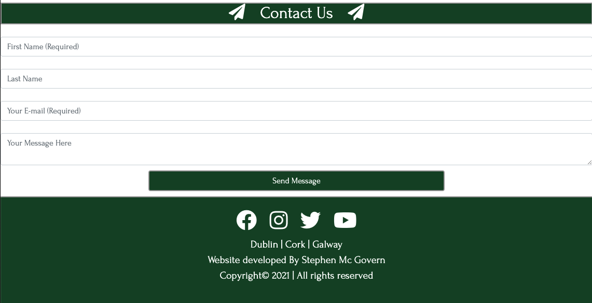

Before the user closes the site they go back to the Google map as they remember that there different categories listed. They can see after clicking through the categories that there is a range of different bars, restaurants and tourist attractions listed. 

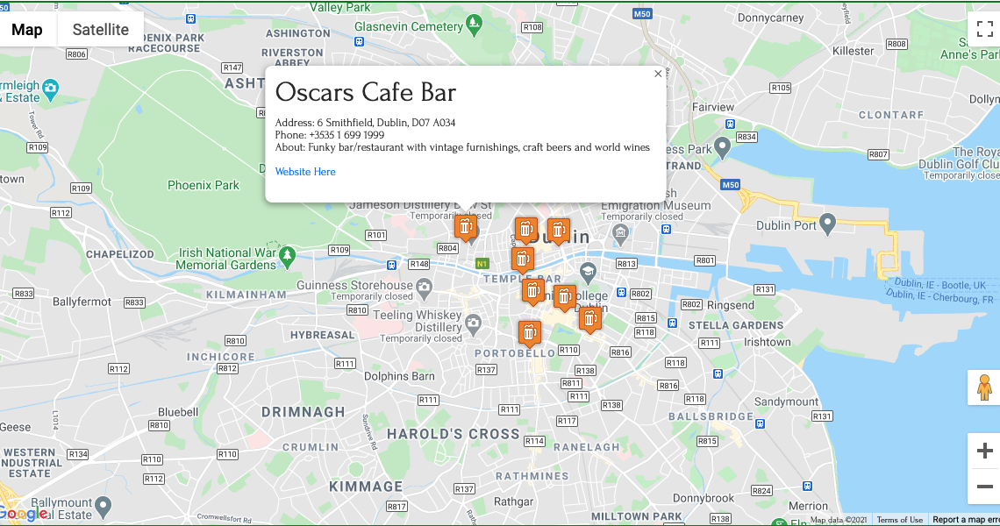

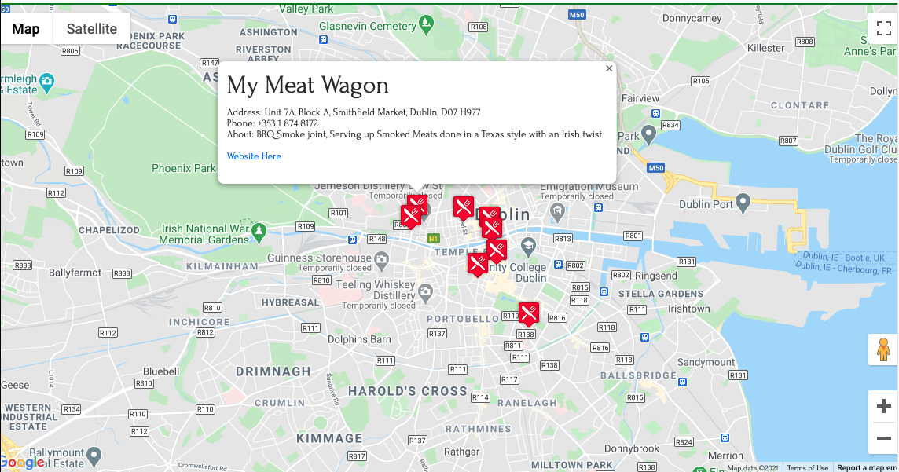

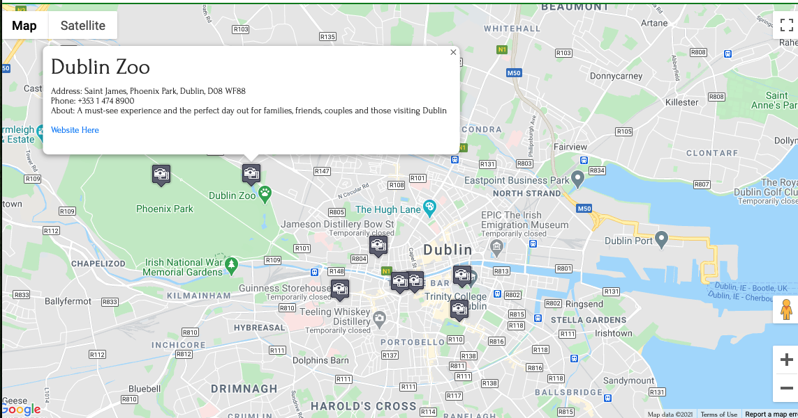

The user will look at these options with their friends before booking their trip so they have a shortlist of places drawn up before they arrive. 

### **1.4 - Design Choices** ###

* I wanted the website to be very visual and not just a lot of text. Therefore I have incorporated a lot of imagery on each page, inserted weather and flights widgets, videos and google maps with places/location markers for each map. 

**FONTS**

* For the website i decided to use the google font style of Forum. Forum has antique, classic "Roman" proportions. It can be used to set body texts and works well in titles and headlines too. It is truly multilingual, with glyphs for Central and Eastern Europe, Baltics, Cyrillic and Asian Cyrillic communities. The link to the Forum font on Google Font can be found by clicking: [Here](https://fonts.google.com/specimen/Forum?preview.text_type=custom#glyphs)

**ICONS**

* I also decided to incorporate some icons throughout the website. I did this because icons give a more visually pleasing experience for the user and also relate to the type of information that they are looking at. I also incorporated social media icons (Facebook, Twitter, Instagram, YouTube) that are located in the footer of the page.

* Some of the icons on the site were taken from the Font Awesome website. The link to the Font Awesome website can be found by clicking: [Here](https://fontawesome.com/)

* The icons i used for markers on the Google Map page were icons that come from map icons collection. They have a wide range of icons that you can customize in terms of design and colour. The link to these icons can be found [Here](https://mapicons.mapsmarker.com/category/markers/) 

**COLOURS**

* I used the website colour mind when deciding on which colours to use. The website uses a generator to help you select the best matching colour palettes for your project. The website can be found by clicking this link: [Here](http://colormind.io/)

* For the base colours i decided to go with the following colour palette 

* The reason for this particular pallet is because these are the colours for each city. 

  #FF0000 & #FFFFFF are the colours of Cork 
  #9C0404 & #FFFFFF are the colours od Galway

* Dublin's official colour is #040484 which is a navy blue, however the initial feedback i got from people who viewed the early site was that as the site is a guide to Irish cities they would have liked, and expected to see a lot more green. Therefore i decided to make the Dublin page a mix of 

  #124624 (Green) & FFFFFF (White)  
  #9D9D9D (Silver/Grey) is used as the border on several items on the page. 

* I also went for a secondary colour palette for more minor touches on the site. These colours can be seen below:

### **1.5 - Wire Frames** ###

[Homepage Desktop](https://ibb.co/0J7YYNN) 
[Homepage iPad Horizontal](https://ibb.co/74tx7yr) 
[Homepage iPad Vertical](https://ibb.co/9Y8jjMr) 
[Homepage mobile phone](https://ibb.co/pdVcJKW) 

[City page Desktop](https://ibb.co/C7J1ydC) 
[City page iPad Horizontal](https://ibb.co/g6zg3RG) 
[City page iPad Vertical](https://ibb.co/vDkK11v) 
[City page mobile phone](https://ibb.co/0ZqnqSf)
>
## **2. Features** ##

I have created the website so all of the city pages have the exact same features. I did this because i wanted the users to have the same features on every page so no matter what city they were thinking of visiting, the layout and features will be the same to help with user experience. The breakdown of the features on each page are listed below: 

### **2.1 - The Navbar** ###

For the Navbar i decided to use a standard Bootstrap 4.4 Navbar. I chose this option because i wanted the Navbar to be responsive on all screen sizes and bootstrap offers this easily. 

The Navbar on each page is standardized, the link to the homepage is located on the top left hand side, on the right hand side we have 

1. About City
2. Getting Here 
3. Things To Do
4. Contact Us

On smaller screen sizes the navbar will collapse into a hamburger menu that when clicked will expand and reveal the nav bar items.

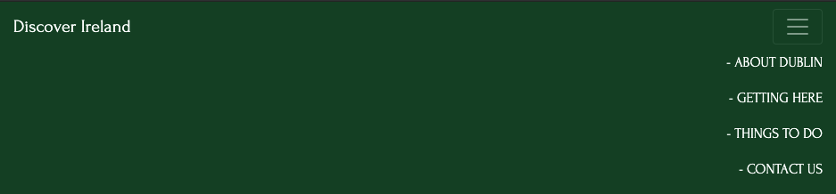

### **2.2 - JavaScript weather widget** ###

Below the Navbar i have installed a weather widget that will display an animated 7 day forecast. This will display the weather for each city when the user is on the page. I have also set this so the background will reflect the current weather conditions and whether it is night or day. The widget is also responsive and will adjust depending on screen size.

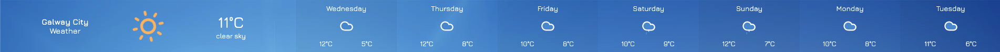

### **2.3 - Photo Carousel** ###

I wanted to use some great images on the website. To achieve this i have used a bootstrap carousel to show several different images of each city to users. The photos are also set to auto scroll and at the footer of the images there is some text that describes what each image is. 

### **2.4 - SkyScanner JavaScript Widget** ###

I have also installed a Skyscanner widget on the website. This will allow users of the site to enter the city they are flying from, the dates they are looking to fly, and when the click on search flights Skyscanner will give them flight availability and prices. As the site isn't an integrated partner booking a flight on the site isn't possible, instead the user is diverted to the Skyscanner page.

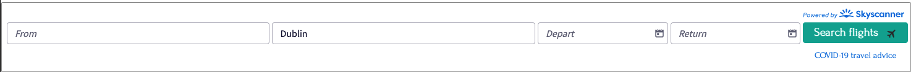

### **2.5 - Video JS** ###

I wanted to use as wide a range of options as possible to display information to users. People engage with video a lot more than they do with just pages and pages of text. Because of this on every city page i have created a video player that will play a short video from the local tourist board that will show users some of the tings they can expect to see/do in each city.

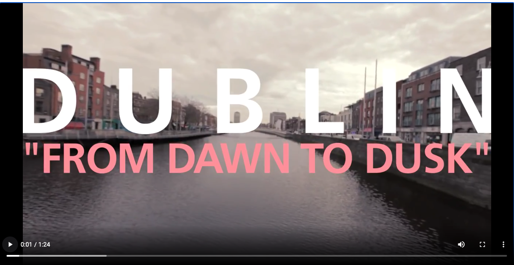

### **2.6 - Google Maps API** ###

I have added a Google Map to each city page. Users can click on the dropdown menu and select which category they are looking for recommendations for.

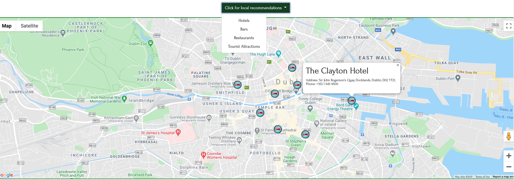

To activate the functionality for these Google map i needed to generate an API key on the Google maps dashboard. To secure this API from being copied and used by other people i have restricted its use in my Google maps dashboard. 

### **2.7 - Contact Us Forum** ###

At the bottom of every page i have placed a contact us form where users can send emails direct to us. The contact us form has Email JS operating on the backend. Once a user clicks ont he send message button an alert will populate to show the user the message was sent. Email JS will also send an auto reply to the user to let them know their message was successfully received and that we will be back in contact with them.

I have also created a caps lock notification for the email input so the user will get a pop up alert if they have caps lock on when they try and enter their email address. 

### **2.8 - The Footer** ###

In the footer i have listed all of the companies social media links. As with the navbar, the footer is identical on each page to maintain consistency no matter what page the user finds themselves on.

>
## **3. Technologies/Languages Used** ##

* 3.1 - [Gitpod](https://www.gitpod.io/) - Is the IDE recommended for Code Institute students and the one i chose to develop this project in.
* 3.2 - [HTML5](https://html.com/html5/#What_is_HTML) - This is the markup language i used for this project. 
* 3.3 - [CSS](https://en.wikipedia.org/wiki/CSS) - I used CSS to help alter and adjust the presentation of the website to create a pleasant user experience. 
* 3.4 - [JavaScript](https://en.wikipedia.org/wiki/JavaScript) - JavaScript often abbreviated as JS, is a programming language that conforms to the ECMAScript specification. Alongside HTML and CSS, JavaScript is one of the core technologies of the World Wide Web. 
* 3.5 - [Bootstrap](https://getbootstrap.com/) - Bootstrap is the most popular CSS Framework for developing responsive and mobile-first websites. Bootstrap 4 is the version i used for the development of this project. 
* 3.6 - [Google fonts](https://fonts.google.com/) - Launched in 2010 Google Fonts is a library of 1,023 free licensed font families. 
* 3.7 - [Font Awesome](https://fontawesome.com/) - Font Awesome is a font and icon toolkit based on CSS and Less. It was made by Dave Gandy for use with Bootstrap, and later was incorporated into the BootstrapCDN. Font Awesome has a 38% market share among those websites that use third-party font scripts on their platform. 
* 3.8 - [W3schools](https://www.w3schools.com/) - W3Schools is a training website for learning web technologies online.  
* 3.9 - [Balsamiq](https://balsamiq.com/) - Balsamiq Wireframes is a rapid low-fidelity UI wireframing tool that reproduces the experience of sketching on a notepad or whiteboard. 
* 3.10 - [Weather Widget IO](https://weatherwidget.io/) - Is a free customizable weather widget that you incorporate into your website using JavaScript and HTML. 
* 3.11 - [Skyscanner JavaScript Widget](https://www.partners.skyscanner.net/affiliates/widgets-documentation/simple-flight-search-widget) Skyscanner is a travel fare aggregator website and travel metasearch engine. Site visitors can use Skyscanner to plan and book their travels, including flights, hotels, and car hire, at the best prices. 
* 3.12 - [VideoJs](https://videojs.com/) - Video. js is a web video player built from the ground up for an HTML5 world. It supports HTML5 video and modern streaming formats, as well as YouTube, Vimeo, and even Flash (through plugins, more on that later). It supports video playback on desktop and mobile devices. 
* 3.13 - [Google Maps API](https://developers.google.com/maps/documentation/javascript/overview) - The Google Maps Platform is a set of APIs and SDKs that allows developers to embed Google Maps into mobile apps and web pages, or to retrieve data from Google Maps.
 
* 3.14 - [Email JS](https://www.emailjs.com/) - EmailJS helps to send emails using client-side technologies only. No server is required, just connect EmailJS to one of the supported email services, create an email template, and use our Javascript library to trigger an email.

* 3.15 - [Favicon](https://favicon.io/favicon-generator/) - A free and simple website that allows you to create, build and customize your Favicons for your own site. 
>

## **4. Testing** ##

* Testing information can be found in the [testing.md](testing.md) file

>
## **5. Deployment** ##

### **5.1 Deployment** ###

To deploy the site on Github i undertook the following steps:

1. Navigated to my profile page on Github
2. Selected this project from the repositories
3. Clicked on settings
4. Scroll down to the Github pages section
5. Click where is says source and in the dropdown menu select master
6. Click on the next dropdown menu to the right select /(root)
7. Click save

You will then receive a confirmation saying the page has been published and also be provided with the link where people can view your site.

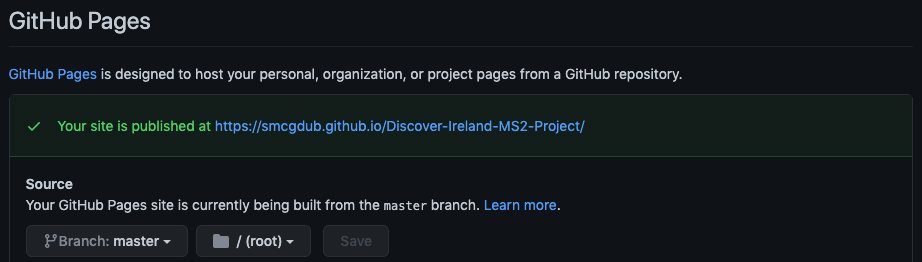

The link to view the published site can be found by clicking [Here](https://smcgdub.github.io/Discover-Ireland-MS2-Project/)

### **5.2 Cloning** ###

You can clone the projects repository to your local computer by following the steps below:

Cloning a repository using the command line

1. On github navigate to the project repository. The link can be found here: https://github.com/smcgdub/Discover-Ireland-MS2-Project
2. Click on the tab that says < >code
3. Above the files, click the button that says ↓code

4. From the menu select HTTPS
5. Click on the clipboard icon on the right hand side (Image below)

6. Open the terminal in your IDE
7. Change the current working directory to the location where you want the cloned directory.
8. In terminal type git clone and then paste the URL you copied earlier: https://github.com/smcgdub/Discover-Ireland-MS2-Project
9. Press Enter to create your local clone

### **5.3 Cloning Desktop** ###

You can also clone the project using Github Desktop. To do this you can do the following:

1. Download Github Desktop if you do not already have it installed. The link can be found here: [GitHub Desktop](https://desktop.github.com/)
2. Sign in to GitHub and GitHub Desktop before you start to clone.
3. On github navigate to the project repository. The link can be found here: https://github.com/smcgdub/Discover-Ireland-MS2-Project
4. Click on the tab that says < >code
5. Above the files, click the button that says ↓code

6. Click open with GitHub Desktop to clone and open the repository with GitHub Desktop.
7. Click Choose... and, using the Finder window, navigate to a local path where you want to clone the repository
8. Click clone

>
## **6. Credits** ##

### **6.1 Media** ###

**GLOBAL**

* Homepage/Landing page beach image 
Photo by <a href="https://unsplash.com/photos/NWcnShn8vfk?utm_source=unsplash&utm_medium=referral&utm_content=creditShareLink">Chris Marquardt</a> on Unsplash
 
[Image Here](https://unsplash.com/photos/NWcnShn8vfk)

* Airport Arrivals Picture purchased from iStock Photo
 
[Image here](https://www.istockphoto.com/photo/airport-arrivals-sign-in-dublin-ireland-gm181077388-25334697) 

**DUBLIN PAGE** 

CAROUSEL IMAGES 

* Dublin city at night carousel image 
Photo by <a href="https://unsplash.com/@andrei_carina?utm_source=unsplash&utm_medium=referral&utm_content=creditCopyText">Andrei Carina</a> on Unsplash
 
[Image Here](https://unsplash.com/photos/jLi7xbYnYro)
  
* Howth cliffs carousel image 
Photo by <a href="https://unsplash.com/@aem?utm_source=unsplash&utm_medium=referral&utm_content=creditCopyText">Adam Markon</a> on  Unsplash.
 
[Image Here](https://unsplash.com/photos/Q-9FsufnVEA)

* Trinity college carousel image 
Photo by <a href="https://unsplash.com/@alexblock?utm_source=unsplash&utm_medium=referral&utm_content=creditCopyText">Alex Block</a> on Unsplash
 
[Image Here](https://unsplash.com/photos/PdDBTrkGYLo)

THINGS TO DO DUBLIN VIDEO

* Dublin: Dawn to Dusk Video 
All rights belong to Visit Dublin

OUR RECOMMENDATIONS DUBLIN

* Whelan's Music Venue 
Photo by <a href="https://unsplash.com/@themephotos?utm_source=unsplash&utm_medium=referral&utm_content=creditCopyText">Theme Photos</a> on Unsplash
 
[Image Here](https://unsplash.com/photos/kPHYuzqoaz0)

* Network Coffee Image 
Image supplied by Network Coffee  
All rights to Network Coffee 

* EatTokyo Sushi Image 
Photo by <a href="https://unsplash.com/@viniciusbenedit?utm_source=unsplash&utm_medium=referral&utm_content=creditCopyText">Vinicius Benedit</a> on Unsplash
 
[Image Here](https://unsplash.com/photos/-1GEAA8q3wk)

* Guinness Storehouse Image 
Photo by <a href="https://unsplash.com/@erikjakeix?utm_source=unsplash&utm_medium=referral&utm_content=creditCopyText">Erik Jacobson</a> on Unsplash
 
[Image Here](https://unsplash.com/photos/w578cN0JxIw)
  
>
**CORK PAGE** 

CAROUSEL IMAGES 

* Cork at night carousel image
 
Photo by <a href="https://unsplash.com/@2sometravel?utm_source=unsplash&utm_medium=referral&utm_content=creditCopyText">2sometravel</a> on Unsplash.
 
[Image Here](https://unsplash.com/photos/jiXbDuh8YIo)

* Gougane barra church carousel image 
 
Photo by <a href="https://unsplash.com/@mrmarkdejong?utm_source=unsplash&utm_medium=referral&utm_content=creditCopyText">Mark de Jong</a> on Unsplash
 
[Image Here](https://unsplash.com/photos/P8TK5WPyFQY)  

* Cork river at sunset carousel image
 
Photo by <a href="https://unsplash.com/@imjamie?utm_source=unsplash&utm_medium=referral&utm_content=creditCopyText">Jamie O’Sullivan</a> on Unsplash
 
[Image Here](https://unsplash.com/photos/WAh9lIRcVaU)
  
THINGS TO DO CORK VIDEO

* PureCork: Cork Welcomes Video 
All rights belong to Pure Cork

OUR RECOMMENDATIONS CORK

* Costigan's Pub (Our top recommendations) image
 
Photo by <a href="https://unsplash.com/@mehrad_vosoughi?utm_source=unsplash&utm_medium=referral&utm_content=creditCopyText">Mehrad Vosoughi</a> on Unsplash
 
[Image Here](https://unsplash.com/photos/HpN5rf4QVuU)
  
* The English Market (Our top recommendations) image
 
Photo by <a href="https://unsplash.com/@nickkarvounis?utm_source=unsplash&utm_medium=referral&utm_content=creditCopyText">Nick Karvounis</a> on Unsplash
 
[Image Here](https://unsplash.com/photos/xrDL8xOgeJQ)

* The Blarney Stone (Our top recommendations) image
 
Photo by <a href="https://unsplash.com/@connormisset?utm_source=unsplash&utm_medium=referral&utm_content=creditCopyText">Connor Misset</a> on Unsplash
 
[Image Here](https://unsplash.com/photos/Sn-5Wcg4P9o)
  
* Cycle Tour Cork (Our top recommendations) image
 
Photo by <a href="https://unsplash.com/@maxberger?utm_source=unsplash&utm_medium=referral&utm_content=creditCopyText">Max Berger</a> on Unsplash
 
[Image Here](https://unsplash.com/photos/GXvrq21TmAs)

>
**GALWAY PAGE** 

CAROUSEL IMAGES 

* Galway harbour night image
 
Photo by <a href="https://unsplash.com/@markusvoetter?utm_source=unsplash&utm_medium=referral&utm_content=creditCopyText">Markus Voetter</a> on Unsplash
 
[Image Here](https://unsplash.com/photos/s12s4dZSwLk)

* Galway harbour houses carousel image 
 
Photo by <a href="https://unsplash.com/@roryhennessey?utm_source=unsplash&utm_medium=referral&utm_content=creditCopyText">Rory Hennessey</a> on Unsplash
 
[Image Here](https://unsplash.com/photos/UR-9hOEW-Ww)

* Killary Harbour carousel image
 
Photo by <a href="https://unsplash.com/@olivier_twwli?utm_source=unsplash&utm_medium=referral&utm_content=creditCopyText">Olivier Guillard</a> on Unsplash
 
[Image Here](https://unsplash.com/photos/T5DAAfCGGQg)
  
THINGS TO DO GALWAY VIDEO

* Discover Ireland: Top Things To Do In Galway Video 
All rights belong to Discover Ireland

OUR RECOMMENDATIONS GALWAY 

* The Quays Bar (Our top recommendations) image
 
Photo by <a href="https://unsplash.com/@themorganlane?utm_source=unsplash&utm_medium=referral&utm_content=creditCopyText">Morgan Lane</a> on Unsplash
 
[Image Here](https://unsplash.com/photos/wlY66otjq28)
  
* BoTown Burger (Our top recommendations) image
 
Photo by <a href="https://unsplash.com/@leecampbell?utm_source=unsplash&utm_medium=referral&utm_content=creditCopyText">Lee  Campbell</a> on Unsplash.
 
[Image Here](https://unsplash.com/photos/ZP1dfOoSEi8)

* Cliffs of Moher (Our top recommendations) image
 
Photo by <a href="https://unsplash.com/@federize?utm_source=unsplash&utm_medium=referral&utm_content=creditCopyText">Federico Beccari</a> on Unsplash.
 
[Image Here](https://unsplash.com/photos/AEallbg9q_A)
   
* Esquires Coffee (Our top recommendations) image
 
Photo by <a href="https://unsplash.com/@nate_dumlao?utm_source=unsplash&utm_medium=referral&utm_content=creditCopyText">Nathan Dumlao</a> on Unsplash
[Image Here](https://unsplash.com/photos/6VhPY27jdps)
  

All Unsplash images are provided under licence that allows free use of them once credit is given. All credits provided above for each image. Licence authorization can be read: [Here](https://unsplash.com/license)

### **6.2 Code** ###

* The HTML code i used was Bootstrap version 4.6. The official Bootstrap documentation is the best place to reference for everything you need: [Bootstrap Documentation Here](https://getbootstrap.com/docs/4.6/getting-started/introduction/)
* The weather widget i used was from WeatherWidgetIO. This widget is free, its dynamic so it works on all screen sizes, and it has an animated feature and is updated regularly throughout the day/night: [Documentation Here](https://weatherwidget.io/)
* For the Video JS player i resourced the official documentation [Video JS Official Documentation Here](https://docs.videojs.com/)
* For the Google map i used the Google maps [Javascript API official documentation](https://developers.google.com/maps/documentation/javascript/overview) and also the Google maps [Places API official documentation](https://developers.google.com/maps/documentation/places/web-service/overview)
* For the Email JS feature i referenced the official [Email JS documentation here](https://www.emailjs.com/docs/)
* To achieve the smooth scrolling effect on the page when you click on an item in the Navbar i followed the tutorial on YouTube by Kevin Powell. The link to the tutorial can be found here: [Smooth scrolling tutorial](https://www.youtube.com/watch?v=x0YnVwAuNQI)

### **6.3 Acknowledgements** ###

* Thank you to all of the tutor team at Code Institute who were always on hand whenever i needed their support.
* A special thanks to the code institute tutor Tim Nelson who was on hand to help me with my Google Maps JavaScript when it wasnt behaving the way i wanted it to.
* A big thank you to my mentor Dick Vlaanderen who gave me great feedback on my initial ideas for the project.
* A final big thank you to all of the other students, CI alumni and CI staff who were always willing to help out and advise on the official CI Slack channels.

>
### **7. Contact Me** ###

If you need to reach me i can be contacted via the three methods below:

7.1 - [LinkedIn](https://www.linkedin.com/in/stephenmcgovern01/) 
7.2 - [Email](mailto:stephen_xyz1@hotmail.com) 
7.3 - [Skype](https://join.skype.com/invite/ndruMu7qVuKZ)
>
### **8. Disclaimer** ###

8.1 - This website and all of its content was completed for my personal assessment and is strictly for educational purposes only.