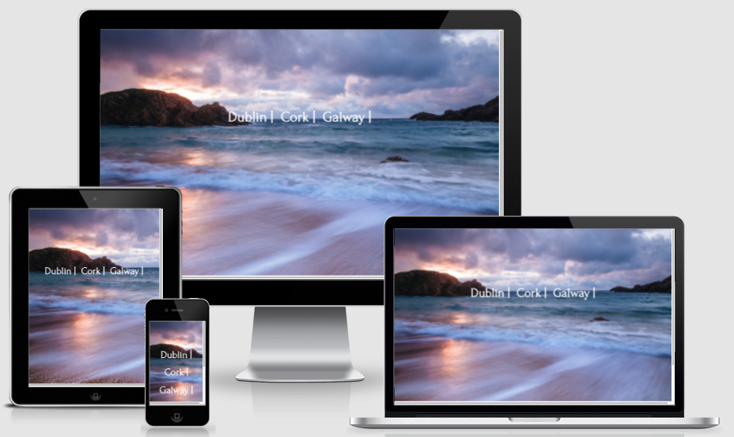
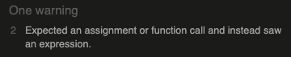
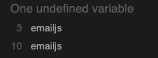

# **Discover Ireland Testing Information** #

>
## **Table of contents** ##

### **1. Automated Testing** ###

* 1.1 HTML Code Validating 
* 1.2 CSS Code Validating 
* 1.3 JavaScript Validating 

### **2. Manual Testing** ###

* 2.1 Manual testing desktop
* 2.2 Manual testing mobile

### **3. JavaScript Specific Testing** ###

* This section is the most detailed and contains all the information for the testing of each Javascript file.

>

### **1. Automated Testing** ###

**1.1 HTML Code Validating**

* All of the HTML files were tested on the [W3C HTML Markup Validation website](https://validator.w3.org/)
* All of the files came back clear with the result of **"Document checking completed. No errors or warnings to show"**

**1.2 CSS Code Validating**

* The main CSS files were tested on the [W3C CSS  Validation website](https://jigsaw.w3.org/css-validator/) 
* All of the files came back clear with the result of **"Congratulations! No Error Found."**

>
### **2. Manual Testing** ###

**2.1 Manual testing desktop**

All desktop testing was carried out on Chrome, FireFox and Safari. 

The testing below was carried out on all pages Dublin, Cork & Galway. To stop duplication this document will refer to testing each item below only once but each test has been carried out identically on each city page.

**1. Navbar**

* Have clicked on the Discover Ireland title on the left of the Navbar. Can confirm it brings the user back to the index.html landing page.
* Have clicked on each item in the Navbar and can confirm the page then brings to user to that section.
* Can confirm on smaller screen sizes and mobile devices the list items in the Navbar collapse and now appear as a hamburger menu. When pressed the menu expands to show items. 

**2. Weather Widget**

* The weather widget is displaying an animated 7 days forecast for each city. The days of the week are displayed correctly

**3. Photo Carousel**

* The 3 photos of each city are all being displayed correctly. The carousel will change images automatically however users and also click through the photos manually.

**4. City coat of arms**

* When the screen is shrunk to a smaller size, or when the user is viewing on a mobile device the coat of arms will disappear and only the text will remain. 

**5. Skyscanner Widget**

* The skyscanner widget has been coded so the airport nearest to each city is already pre populated. The user only needs ot enter there airport of origin and they dates they are looking to travel. 
* If the flight is one way the user leaves the return date blank (This is written in the text above the widget so the user knows to do this if they are booking a one way flight)
* When the user begins to type their airport of origin the widget will pre populate as they type. 
* When the user enters their details and clicks search flights a new page will open on the main skyscanner website. This redirect is also mentioned in the text above so the user knows what to expect. 
* There is an ability for Skyscanner approved partners to incorporate the Skyscanner booking engine onto their page however as this is only a small project it was not possible to implement this feature as we are not an approved travel partner. 

**6. YouTube Video**

* All of the YouTube videos from the tourist board are loading correctly. They do not autostart and users must press play themselves to start the video. The user can also adjust the volume of the video in the controller. 
* While viewing the site on Firefox (Version 86.0 on Mac) users are given the option to continue to watch the video in a pop out window while the continue to browse the website.  

**7. Google Map**

* The map loads correctly on every page with the correct zoom setting and map center set.
* When the user clicks on the "Click for local recommendations" button a drop down list appears with the categories of Hotels, Bars, Restaurants and Tourist Attractions. 
* Each category has a different marker icon so the user can distinguish what category they are looking at.
* When you click on a marker the info window will open above it displaying the Name, Address, Phone Number, About & website hyperlink for each place. 
* When the user selects a different category the previous markers will all clear from the map and the new ones will appear. This was done so the screen doesn't end up cluttered and the user is only seeing markers relative to what category they have selected. 

**8. Our Top Recommendations**

* I have placed 4 different Bootstrap cards in this section. Each card has two buttons. The first button will bring you tot he website/booking portal of the recommendation depending on what it is The second button (Click for directions) will open google map (In. a different window) and drop a pin in the location of the recommendation in question. I have tested all of the links and they are all working correctly.

**9. Contact Us Form**

* I have used Email JS for this contact us form. When the user sends an email via the website they will receive a pop up notification confirming their message has been sent. 
* I will also receive an email with the users message and details. First name and e-mail address are required fields and the message will not send unless these fields have been populated. 
* The user will also receive an automated email from the site confirming their message has been received and confirms someone will be in contact with them soon.
* I have also added a spell check to the free text message box on the contact us form. 

**Note:** - Once the user message has been submitted via the site, the auto reply can sometimes vary in the speed of the response being sent to the user. This is down to Email JS and is out of my control. I have set it so Email JS should send the email immediately. 

The incoming message the site receives from the user is always received immediately. 

**10. The Footer**

* The footer of each page contains the social media icons and the links to the different cities. 
* I have tested all of the social media links behind the icons on each page and they all point to the correct social media site relative to the icon. When clicked the social media site will open in a new tab/window 
* I have also tested the city links and they also point to the correct page. 
>
**2.1 Manual testing mobile**

**1. Navbar**

* When viewing on a tablet horizontally the Navbar will display all of the list items the same as a desktop. 
* When held vertically on a tablet the Navbar will display with the hamburger menu in place. 
* On mobile phones whether held horizontally or vertically the Navbar will always appear as a hamburger menu. When pressed the hamburger menu expands to show the list items. 
* Have clicked on the Discover Ireland title on the left of the Navbar. Can confirm it brings the user back to the index.html landing page.

**2. Weather Widget**

* The weather widget is displaying an animated 7 days forecast for each city. The days of the week are displayed correctly.
* On mobile phones the weather widget height is increased to 2 rows. The top row is the current weather and the 2nd row below is the 7 days forecast. 

**3. Photo Carousel**

* The 3 photos of each city are all being displayed correctly. The carousel will change images automatically however users and also click through the photos manually.
* On small screen sizes (Mobile phones) the text description for the photo will not be visible, just the image, 

**4. City coat of arms**

* When the tablet is held horizontally the coat of arms is displayed.
* When the tablet is held vertically and on mobile phones the coat of arms is not visible.  

**5. Skyscanner Widget**

* The Skyscanner widget on mobile devices works the same was as it does on desktop. 
* The widget is responsive so the layout will automatically adjust depending on screen size. 

**6. YouTube Video**

* All of the YouTube videos from the tourist board are loading correctly. They do not autostart and users must press play themselves to start the video. The user can also adjust the volume of the video in the controller. 
* On mobile if the user clicks on the title of the video the YouTube app (If installed on the device) will open and the vide will play on there. 

**7. Google Map**

* The Google Map opens and functions the exact same way it does on desktop. 
* On mobile devices the user must use 2 fingers to move and adjust the map as is normal on most mobile devices. This allows the user to drag the page up and down even if they are doing so by holding 1 finger on the map.

**8. Our Top Recommendations**

* On a tablet when holding horizontal the 4 recommendations will be displayed on 1 single row as they are on a desktop.
* When the tablet is held vertically the recommendations forms on 2 rows instead of 1. There will be 2 recommendations on each row. 
* On small screens and mobile phones the recommendations will be stacked one on top of the other. 

**9. Contact Us Form**

* The contact us form works exactly the same on mobiles and tablets as it does on desktops. 

**10. The Footer**

* The footer works exactly the same on mobiles and tablets as it does on desktops.  
>

### **3. JavaScript Specific Testing** ###

I have created 5 different active JavaScript files in this project. They are:

1. app.js
2. email.js
3. maps-dublin.js
4. maps-cork.js
5. maps-galway.js

### **1. The app.js file** ###

* This file contains the JavaScript for the creation and loading of the weather widgets, the 3 YouTube videos on the site (One on each city page) and for the smooth scrolling effect you get from clicking on a list item in the Navbar.

**TESTING OF THE APP.JS FILE**

The testing for the app.js file was carried out on [JShint.com](https://jshint.com/) The results from the test were as follows:

NOTES ON TESTING 

1. The one warning on line 4 i have ignored. This is for the weather widget that is displayed at the top of each page. I have followed the instructions from the weather widget provider and the code is correct. The functionality of the widget has been tested thoroughly on each page and it is working exactly as intended. 

2. JShint has listed "Two undefined variables" of YT and $. Again this is incorrect and i have ignored it.  
2.1 The YT relates to the creation of a new YT.player for the YouTube videos. The code i have used is referenced direct from the Google YT Documentation. The YouTube videos have been tested thoroughly for functionality and they are all working perfectly and as expected.  
2.2 The $ is the JQuery for the smooth page scroll function that happens when a user clicks on an item in the Navbar. Again this has been tested thoroughly for functionality and it is working perfectly and as expected. 

3. The result of "One unused variable" for onYouTubeIframeAPIReady again is incorrect and i have ignored it. This is the function name given to create a new YouTube player and again is taken under instruction from the official YouTube documentation. Each player has been tested thoroughly for functionality and they are working perfectly and as expected

**IMPROVE PERFORMANCE OF THE APP.JS FILE**

* To help with site load times i have used the website [JavaScript Minifier](https://javascript-minifier.com/). This site allows you to enter your original JavaScript code into it and the site will then minify it. I have then inserted the minified code into the app.js file. 

* **The original JavaScript code can still be viewed as it is stored in the original-code-app.js file.**

>

### **2. The email.js file** ###

* This file contains the JavaScript for the Email JS contact us form. 

**TESTING OF THE EMAIL.JS FILE**

The testing for the app.js file was carried out on [JShint.com](https://jshint.com/) The results from the test were as follows:

NOTES ON TESTING 

1. The "One undefined variable" on lines 5 and 15 i have ignored. I used the official Email JS Documentation as my guide and the contact us form on each page has been tested thoroughly and it is working exactly as intended. 

* I did try to put the email.js file in the JavaScript minifier but it seemed to effect the performance so i left the code as it was originally. 

>
**3. The maps-dublin/cork/galway.js files**

* I have created a separate Google maps.js file for each city. 
* This file is the file that creates the google map on each page. It also created the markers, the icons, and has the code for clearing the map and dropping the icons when the user selects the category they are searching for from the "Click for local recommendations" drop down menu. 
* Again with each of these files a ran it through the JavaScript Minifier to compress the code so as to aid with page load times. 